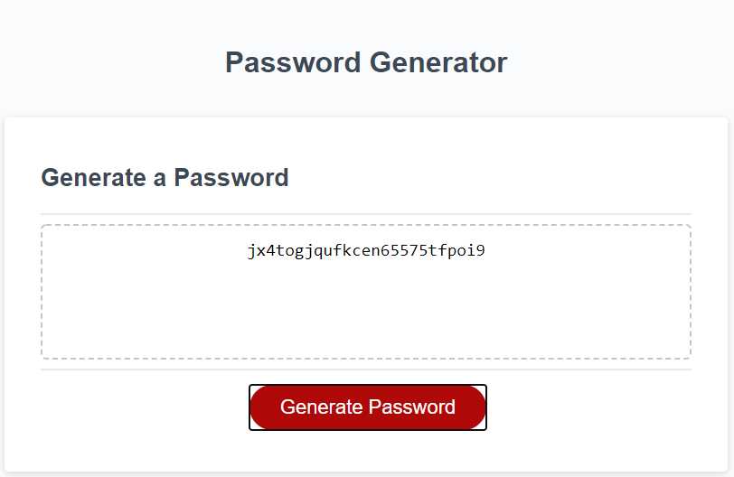

# 03-hw-javascript-pw #

## Task ##

Create a Password generator using Javascript.

## Acceptance Criteria ##

```
GIVEN I need a new, secure password
WHEN I click the button to generate a password
THEN I am presented with a series of prompts for password criteria
WHEN prompted for password criteria
THEN I select which criteria to include in the password
WHEN prompted for the length of the password
THEN I choose a length of at least 8 characters and no more than 128 characters
WHEN asked for character types to include in the password
THEN I confirm whether or not to include lowercase, uppercase, numeric, and/or special characters
WHEN I answer each prompt
THEN my input should be validated and at least one character type should be selected
WHEN all prompts are answered
THEN a password is generated that matches the selected criteria
WHEN the password is generated
THEN the password is either displayed in an alert or written to the page
```

## Method ##

Created a Variable List in the parent js file. Used lower case and upper case letters, numbers and all the special charcters from a standard keyboard.
Created empty variable called combine characters, which has an empty array that will be used to store the random characters chosen.
Created a Variable called finalPassword which will display all the characters that were randomised and at the length the user had chosen into its final form.

Created a generatePassword function.

Created a prompt for the user entry which will check for a numerical value and also a value between 8-128. Will display an alert box with a warning message if the user has entered an incorrect value.

Created 4 variables for choosing different options for the password. Each will run a if statement if confirmed to run a ForLoop to push the characters chosen into the empty array combineCharacters. A confirm method is used for the popup choice. 

Created a ForLoop which checks the userEntry variable for number of characters. Will push combineCharacters into finalPassword at random. Creates a varibale named final which uses the join method to concatenate all of the elements into the array and convert into a string. Which is then displayed on the webpage as the random password.

Tested Password generator and working properly.

# Final Product #




## Links to Repo and working page ##

### Link to repo ###

https://github.com/CPetrevski/03-hw-javascript-pw

### Link to page ###

https://cpetrevski.github.io/03-hw-javascript-pw/

